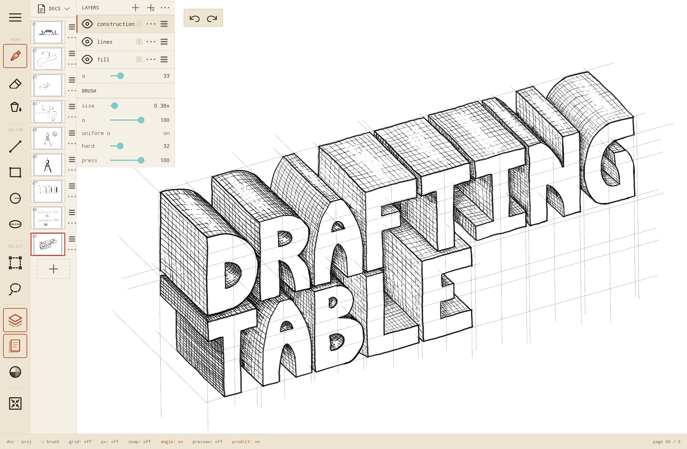

# Drafting Table

Ben's notes:

I wanted a drawing app for my [Wacom MovinkPad 11](https://estore.wacom.com/en-us/wacom-movinkpad-11-dtha116cl0z.html) tablet that combines features from conventional drawing programs, slide decks, and paper engineering notebooks.  This is a  attempt at creating that.  This is *not* intended to be a full-blown painting program: it's designed for making technical sketches.

"Documents" are organized into pages, with a sidebar for previewing and navigating between pages, like a slide deck.  Tapping on a page in the sidebar loads that page onto the canvas.  Each page has its own set of layers.  

In addition to raster brush tools, vector primitives (lines, rectangles, circles, ellipses) can be constructed on vector layers. I find these useful for creating construction geometry in technical sketches.  Vector objects can be transformed after creation, or rastered down to the raster layer below. Vector "snapping" can be toggled, so the start/end/midpoints of vector objects snap to points on other vector objects, or to nodes on the (toggleable) graph paper background.  Snapping can be toggled from the pen, so it's easy to snap one end of a vector but not the other, mid-creation.

Pen-to-glass latency is significantly less than other drawig apps I've measured (25-35ms, vs ~75ms for other programs)

I have only tested on the MovinkPad 11, and it will almost certainly not work out-of-the-box on any other tablet. But Claude can probably fix it for you :P

Beware:  100% of the code is written by Claude.  

Claude Code generated Readme below:

## Features

**Document model**
- Multi-page documents, each with its own layer stack and on-disk subdirectory.
- Per-doc page sizes (presets: device default, US Letter, A4, hi-res, custom).
- Documents persist on tablet storage; the last-opened doc reopens on launch.
- Multiple documents (new / open / delete from the docs button).
- Export current page to PNG, full document to PDF.

**Layers**
- Raster and vector layers, mixed freely.
- Per-layer name, visibility, opacity.
- Drag-to-reorder, delete, rename (long-press a row).
- Rasterize a vector layer in place, or rasterize a single selected vector shape onto the layer below.

**Tools**
- Brush (size, opacity, hardness sliders).
- Eraser.
- Bucket fill (with adjustable bleed).
- Vector shapes: line, rectangle, ellipse, circle.
- Selection — rectangular, lasso. Lifts pixels into a floating raster selection with move / scale / rotate handles. Copy / paste / delete.
- Vector selection — tap a shape to select; same transform handles.
- Eyedropper — sample any pixel under the pen as the active color.
- Image import as a floating raster selection on a fresh layer (with fixed-aspect scaling).

**Color**
- Color picker dialog with HSV square + hue slider + editable HEX/RGB readout, 16-color default palette, recents, user "my-slots", eyedropper.
- Primary / secondary color swap.

**Snapping**
- Snap to grid intersections and other vector geometry.
- Velocity-gated engagement: snap activates when the pen settles near a target, not when sweeping past.
- Wide release radius when slow / stationary (so hand tremor doesn't break the lock); tight release when moving deliberately.

**Input**
- EMR stylus + pressure.
- Stylus side buttons: middle = toggle brush/eraser, far = undo, near = toggle snap.
- 2-finger pan / pinch / rotate of the canvas.
- Palm rejection.

**Other**
- Undo / redo, 50 entries / 200 MB, covers raster strokes, vector add/delete/mutate, layer clear, layer add..
- Status bar with quick toggles for grid and snap.
- Reset-view fits the page edge-to-edge.

## Build & run (first time)

1. Open this directory in Android Studio (File -> Open -> select `drawing_app`).
2. Android Studio will prompt to sync Gradle and download the wrapper jar (the wrapper jar is intentionally not in this repo). Let it run.
3. If prompted, install the requested SDK / NDK / CMake versions via the SDK Manager.
4. Connect the MovinkPad over USB (or via wireless ADB — see `NOTES.md`).
5. Hit **Run** (Shift+F10). The app installs and launches.

If `adb devices` doesn't show the tablet from inside Android Studio, accept the host-key prompt on the tablet.

## Build & run (CLI)

```powershell
.\gradlew.bat installDebug
adb shell am start -n com.bk.drawing/.MainActivity
adb logcat -s DrawingApp        # native log tag for renderer.cpp
```

If `gradlew.bat` is missing, run `gradle wrapper --gradle-version 8.7` from a Gradle install once (or just open in Android Studio, which regenerates it).

## Project layout

```
drawing_app/
├── settings.gradle.kts
├── build.gradle.kts                # Root: AGP + Kotlin plugin versions
├── gradle.properties
├── gradle/wrapper/                 # Wrapper config (jar fetched on import)
├── app/
│   ├── build.gradle.kts            # App module: SDKs, NDK, deps
│   ├── proguard-rules.pro
│   └── src/main/
│       ├── AndroidManifest.xml
│       ├── java/com/bk/drawing/
│       │   ├── MainActivity.kt          # Activity, panels, key/button handling
│       │   ├── DrawingSurfaceView.kt    # Touch dispatch, view transform, GL callbacks
│       │   ├── NativeRenderer.kt        # JNI surface
│       │   ├── ColorPickerDialog.kt     # HSV picker UI
│       │   └── ColorPickerViews.kt      # HSV square + hue slider custom views
│       ├── cpp/
│       │   ├── CMakeLists.txt
│       │   └── renderer.cpp             # Single-TU native renderer
│       └── res/                         # icons, fonts, themes, strings
├── CLAUDE.md                       # Architecture + invariants for code work
└── NOTES.md                        # Original design intent
```

## Architecture (one-liner)

Two-language split: Kotlin owns lifecycle, UI, touch dispatch, and the doc->view transform; C++ owns all GL state, persistence, undo, and pixel work. The interesting code is concentrated in the four files under `app/src/main/`. Tiles are 256x256 RGBA8, premultiplied, lazily allocated, sparse-mapped per layer; vector layers store parametric shapes. See `CLAUDE.md` for the full breakdown (coordinate spaces, threading model, page-bounds clipping, undo apply order, things-easy-to-break).

## Build details

- **arm64-v8a only** (`abiFilters` in `app/build.gradle.kts`); the MovinkPad is the sole target.
- **min SDK 33** so `GLFrontBufferedRenderer` is available without backports.
- **C++20**, NDK side-by-side, OpenGL ES 3.2.

There is no test suite — validation is by running on the tablet.
